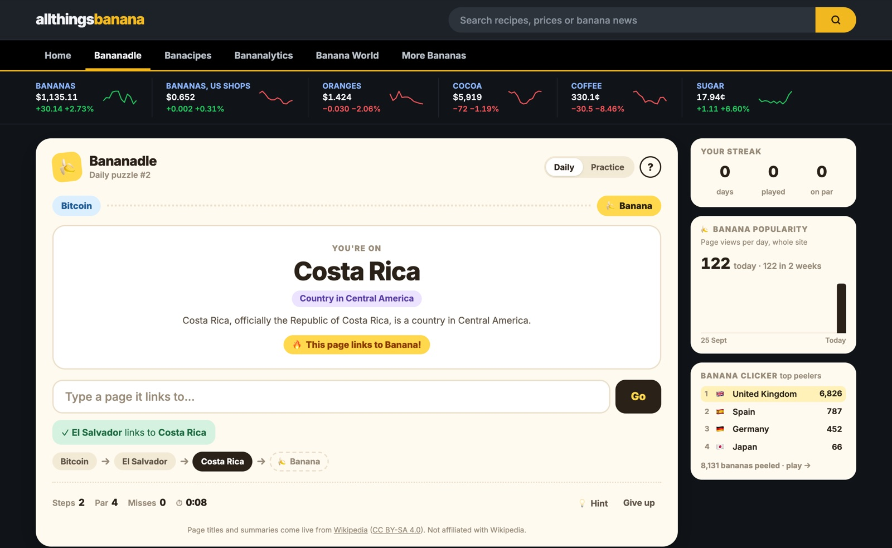
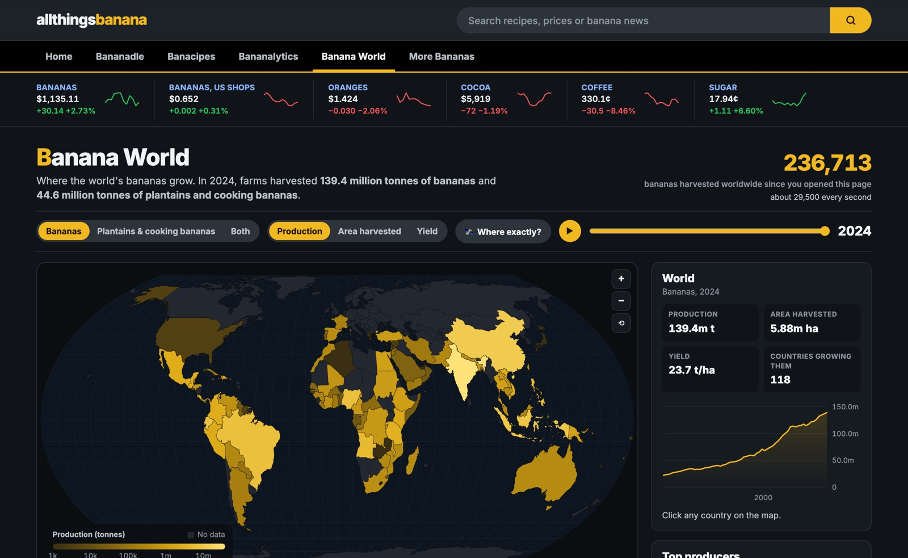
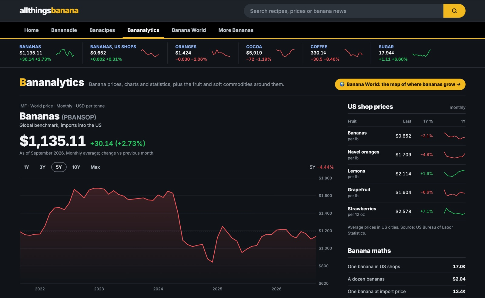
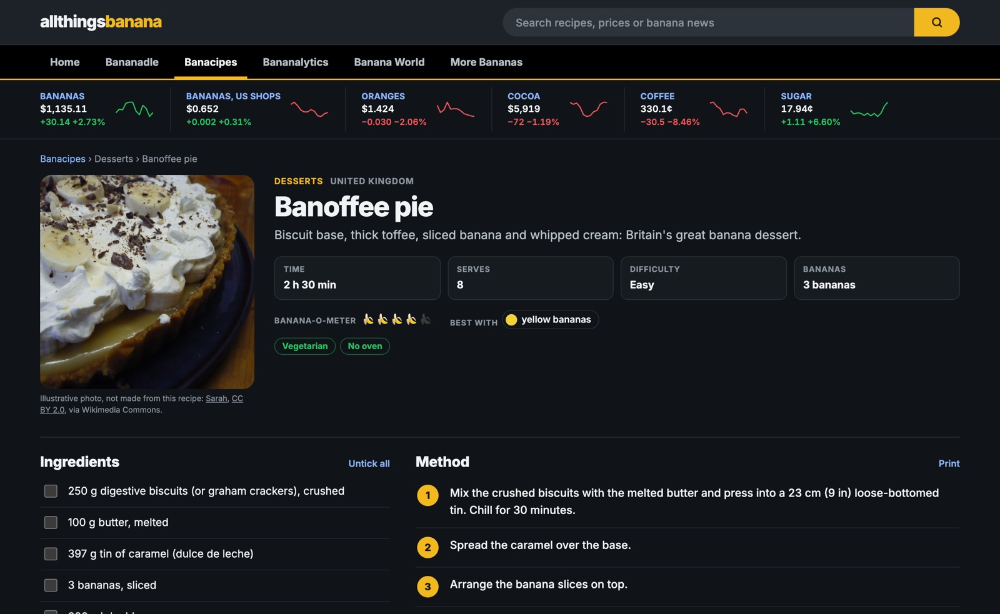
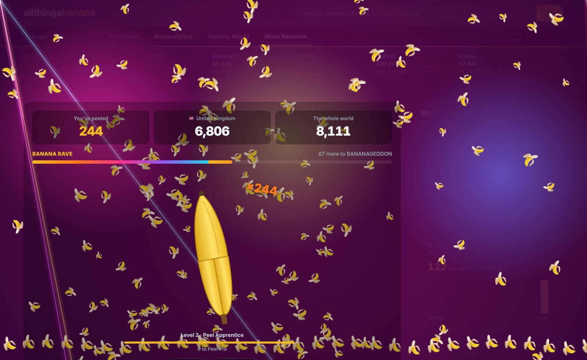
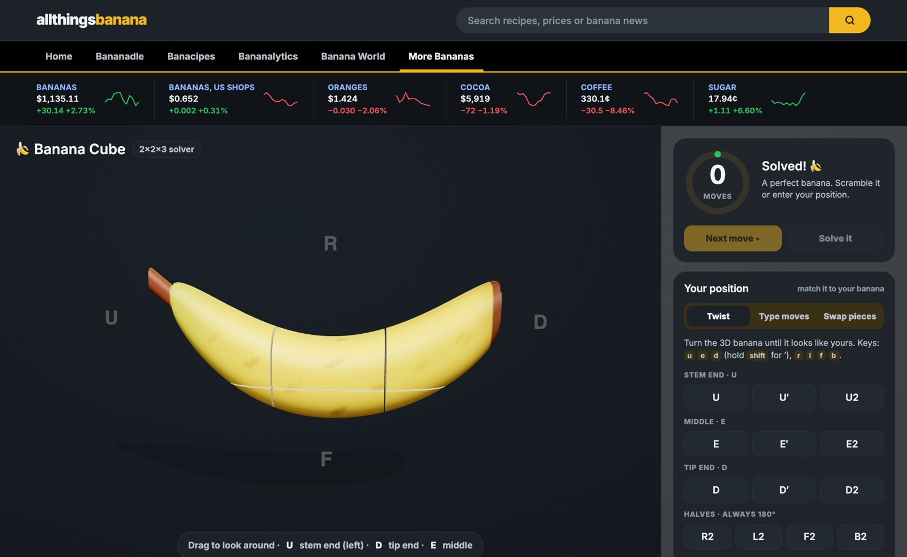
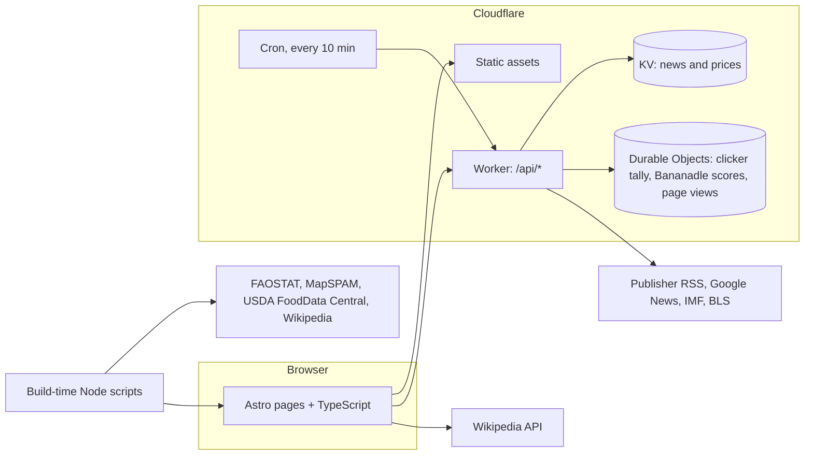

# All Things Banana 🍌

**[allthingsbanana.com](https://allthingsbanana.com)**: a website about bananas, built end to end. It has a daily Wikipedia puzzle, live news and prices, an interactive world map built from UN and satellite data, 90 recipes with nutrition facts, and a few games.



It started as a solver for a banana-shaped twisty puzzle and grew into a full site. Static pages are served from Cloudflare's edge. A Worker collects news and prices on a schedule. Durable Objects hold shared live state, and data pipelines turn public datasets into something you can explore.

## What's on it

| | |
|---|---|
|  **Banana World**: where bananas and plantains grow, for 157 countries from 1961 to 2024 (FAOSTAT), with a satellite-derived layer showing where exactly they're farmed (MapSPAM 2020). |  **Bananalytics**: the world banana price (IMF) and US shop prices (BLS), with interactive charts and a price ticker across the site. |
|  **Banacipes**: 90 recipes you can filter by meal and ripeness, with credited photos and nutrition per serving, plus links to 5,203 recipes from 26 other sites. |  **Banana Clicker**: peel bananas for your country on a live world leaderboard. Keep going and the page turns into a rave, with music synthesised in the browser. |
|  **Banana Cube**: a 3D solver for a 2×2×3 puzzle. It gives the exact number of moves to solved for any of its 241,920 positions. | **Also:** **Bananadle**, the daily puzzle at the top of this page (get from today's Wikipedia article to *Banana*); banana news from publishers, refreshed every 10 minutes; topic hubs with numbered sources; site search; and an anonymous page-view chart. |

## How it's built



- **Pages:** Astro builds 100+ static pages: games, recipes, the map, charts. Interactive parts are plain TypeScript, with no front-end framework shipped to the browser.
- **Worker:** serves the site and a small API (`/api/feed`, `/api/market`, `/api/peel`, `/api/degrees`, `/api/visits`). A cron trigger refreshes news every 10 minutes and prices every 6 hours, keeping them in KV.
- **Durable Objects** give one consistent counter per thing: the clicker's country totals, each day's Bananadle scores and daily page views. Concurrent updates are never lost.
- **Data pipelines** in [`web/scripts/`](web/scripts) turn public datasets into compact files the pages load.

## Interesting problems

**Making Wikipedia connections feel fair (Bananadle).** Wikipedia's style guide discourages linking very common things. So Queen Victoria's article never *links* to England, even though it names England seven times. A move counts if the current page links to the article, or names it in its text, or the other page links back. One-word names only count when they're capitalised mid-sentence, so everyday words like "water" don't become free moves. Guesses are resolved against the live Wikipedia API, all in the browser:
- redirects ("Dubya", "U.S.")
- lowercase titles
- words with several meanings: "Greek" asks which one the page actually uses
- typos, using an edit distance that treats swapped letters as one mistake

The server only stores anonymous daily scores.

**Exact puzzle solving (Banana Cube).** Every position is encoded as an integer from corner permutation × middle permutation × orientation (1,935,360 states). A breadth-first search over the whole space gives the exact distance to solved: all 241,920 reachable positions are within 14 moves. [`banana.py`](banana.py) is a NumPy port used for experiments. [`random_walkers.ipynb`](random_walkers.ipynb) starts 10,000 random walkers on one of the 576 hardest positions and tracks how far from solved they drift.

**A satellite-derived crop map in under 1 MB.** MapSPAM's roughly 10 km grid of harvested area is merged into 10-arc-minute cells and packed as four `Uint16` arrays (629 KB). It's drawn on a canvas beneath a zoomable d3-geo map, alongside 60+ years of FAOSTAT country data.

**Nutrition from free-text ingredients.** Lines like "2 very ripe bananas, mashed" or "397 g tin of caramel" are parsed and matched to USDA FoodData Central foods. Household measures are converted to grams, and optional, garnish and frying-oil lines are handled. The result is per-serving figures (or per slice, cookie or tablespoon), published as schema.org `NutritionInformation` so search engines can show them.

**Live news without a news API.** Publisher RSS feeds are merged with Google News, which often blocks cloud servers. Stories are filtered for relevance, de-duplicated across outlets, and given preview images taken from article pages. A cron Worker does this every 10 minutes into KV.

**Music made from scratch.** The clicker's soundtrack is synthesised live with Web Audio: no samples. It builds as you click and fades into reverb when you stop. [`sound-lab/`](sound-lab) is a standalone sketchpad for designing new tracks (not deployed).

## Responsible by default

- No accounts and no cookies. Counters store totals only, never anything about the visitor.
- The recipe crawler identifies itself and follows each site's `robots.txt`.
- Every recipe photo is under a free licence and credits its author. Every dataset is credited on the page that uses it.
- The clicker has a calm mode and respects reduced-motion settings.

## Tech

Astro · TypeScript · Cloudflare Workers, KV and Durable Objects · Three.js · d3-geo · Web Audio API · Node.js data scripts · Python and NumPy

## Repository

```
web/                    the website and its Cloudflare Worker (details in web/README.md)
  src/pages/            pages: Bananadle, Banana World, Bananalytics, Banacipes, the games
  src/data/             recipes, nutrition, photo credits, map data
  worker/               API, scheduled news and price collection, Durable Objects
  scripts/              data pipelines: FAOSTAT, MapSPAM, USDA nutrition, Wikipedia, recipe crawler
banana.py               the puzzle solver in Python and NumPy
random_walkers.ipynb    the random-walk experiment
sound-lab/              Web Audio sketchpad for the clicker's music (not part of the site)
docs/                   screenshots
```

## Run it locally

```sh
cd web
npm install
npm run dev    # builds the site and runs the Worker at http://localhost:8787
```

Optional API keys, deployment and the data scripts are covered in [`web/README.md`](web/README.md).

## Data and credits

[FAOSTAT](https://www.fao.org/faostat/) (FAO, CC BY 4.0) · [MapSPAM 2020](https://doi.org/10.7910/DVN/SWPENT) (IFPRI, CC BY 4.0) · [USDA FoodData Central](https://fdc.nal.usda.gov/) (public domain) · [IMF Primary Commodity Prices](https://www.imf.org/en/Research/commodity-prices) · [US Bureau of Labor Statistics](https://www.bls.gov/) · [Wikipedia](https://en.wikipedia.org/) (CC BY-SA 4.0) · recipe photographers on Wikimedia Commons and Flickr, credited on each recipe · country shapes from [Natural Earth](https://www.naturalearthdata.com/) via world-atlas.

Built by [@nicknnamsa](https://github.com/nicknnamsa).
